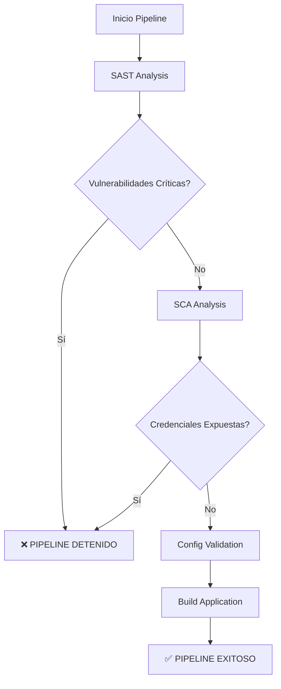
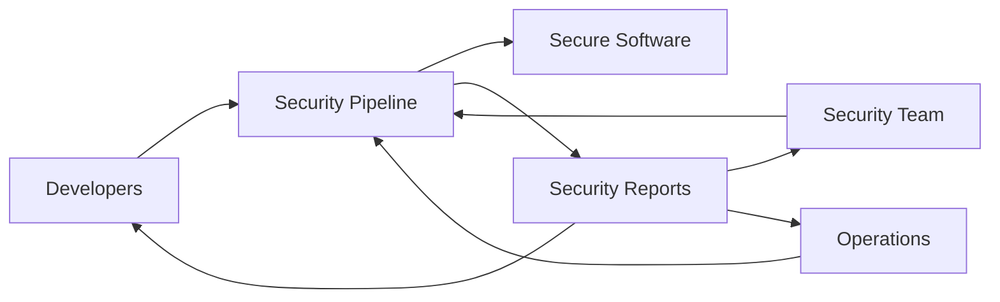

# Prototipo de Validación de Configuraciones Seguras en el Build

## 🎯 Objetivo del Prototipo

Este prototipo implementa un pipeline de seguridad completo que materializa los conceptos teóricos presentados en el trabajo de investigación sobre "Validación de configuraciones seguras durante el Build". El sistema demuestra la viabilidad de integrar controles de seguridad automatizados en etapas tempranas del ciclo de vida del software bajo el enfoque DevSecOps.

##  Arquitectura del Prototipo

### Componentes Principales

1. **Pipeline de Integración Continua (CI)**
   - Plataforma: GitHub Actions
   - Activación: Automática en push y pull requests
   - Entorno: Ubuntu Latest con Java 17

2. **Módulos de Análisis de Seguridad**
   - **SAST**: SpotBugs + FindSecBugs
   - **SCA**: OWASP Dependency Check
   - **Detección de Credenciales**: Gitleaks
   - **Validación de Configuraciones**: YAML/JSON linters

3. **Sistema de Reportes**
   - Reportes estructurados en múltiples formatos
   - Resumen ejecutivo en GitHub Summary
   - Artefactos descargables para análisis detallado

## 🔧 Funcionalidades Implementadas

### 1. Análisis Estático de Código (SAST)

```yaml
🔍 [SAST] Static Application Security Testing
├── SpotBugs + FindSecBugs
├── Detección de vulnerabilidades en código fuente
├── Análisis de malas prácticas de programación
└── Identificación de puntos de explotación potenciales
```

**Vulnerabilidades detectadas:**
- Inyección SQL
- Ejecución de comandos
- Manejo inseguro de excepciones
- Credenciales hardcodeadas
- Permisos excesivos

### 2. Análisis de Composición de Software (SCA)

```yaml
📦 [SCA] Software Composition Analysis
├── OWASP Dependency Check
├── Base de datos NVD actualizada
├── Análisis de dependencias de terceros
└── Detección de CVEs conocidas
```

**Características:**
- Escaneo completo del árbol de dependencias
- Clasificación por severidad (CVSS)
- Supresión de falsos positivos
- Reportes en HTML, JSON y XML

### 3. Detección de Credenciales Expuestas

```yaml
🔐 [CREDS] Credential Leak Detection
├── Gitleaks scanning
├── Patrones de detección actualizados
├── Análisis de archivos de configuración
└── Detección en código fuente y documentación
```

**Patrones detectados:**
- Claves API
- Tokens de autenticación
- Contraseñas
- Certificados
- Credenciales de base de datos

### 4. Validación de Configuraciones

```yaml
⚙️ [CONFIG] Configuration Validation
├── Validación de archivos YAML
├── Validación de archivos JSON
├── Detección de errores de sintaxis
└── Análisis de configuraciones inseguras
```

## 🚀 Principio Fail Fast

El prototipo implementa el principio *fail fast* para detener el pipeline ante la detección de vulnerabilidades críticas:



### Criterios de Detención

- **Credenciales expuestas**: Detención inmediata
- **Vulnerabilidades críticas (CVSS ≥ 7.0)**: Detención inmediata
- **Errores de configuración**: Advertencia pero permite continuar
- **Vulnerabilidades medias/bajas**: Reporte pero permite continuar

## 📊 Sistema de Reportes

### Reportes Generados

1. **Resumen Ejecutivo** (GitHub Summary)
   - Estado general del pipeline
   - Contadores de vulnerabilidades
   - Recomendaciones específicas

2. **Reportes Técnicos**
   - `security-reports/dependency-check-report.html`
   - `target/spotbugsXml.xml`
   - `gitleaks-report.json`

3. **Artefactos**
   - JARs compilados (si pasan validaciones)
   - Reportes de seguridad (30 días retención)

### Métricas de Evaluación

```yaml
📈 Métricas del Prototipo:
├── Efectividad de detección
│   ├── Tasa de detección de vulnerabilidades
│   └── Cantidad de falsos positivos
├── Tiempo de ejecución
│   ├── Duración total del pipeline
│   └── Overhead de seguridad
├── Usabilidad
│   ├── Claridad de reportes
│   └── Facilidad de interpretación
└── Capacidad de respuesta
    ├── Tiempo hasta detección
    └── Precisión del fail fast
```

## 🛡️ Escenarios de Prueba

### Casos de Evaluación Implementados

1. **Credenciales Hardcodeadas**
   ```java
   // VULNERABLE: Credencial expuesta en código
   private static final String API_KEY = "sk-prod-aK93mX02bLpQ77zR";
   ```

2. **Dependencias Vulnerables**
   ```xml
   <!-- VULNERABLE: Log4j con Log4Shell -->
   <dependency>
       <groupId>org.apache.logging.log4j</groupId>
       <artifactId>log4j-core</artifactId>
       <version>2.14.1</version>
   </dependency>
   ```

3. **Inyección SQL**
   ```java
   // VULNERABLE: Concatenación directa de entrada
   String query = "SELECT * FROM usuarios WHERE nombre = '" + nombre + "'";
   ```

4. **Configuración Insegura**
   ```yaml
   # VULNERABLE: Permisos excesivos
   permissions:
     - "*:*"  # Todos los permisos
   ```

## 📋 Resultados Esperados

### KPIs de Seguridad

| Métrica | Objetivo | Medición |
|---------|----------|----------|
| Detección de credenciales | 100% | Gitleaks scan |
| Detección de CVEs críticas | 95%+ | OWASP Dependency Check |
| Tiempo de detección | < 5 min | Pipeline duration |
| Falsos positivos | < 10% | Manual verification |

### Beneficios Cuantificables

1. **Reducción de riesgo**: Detección temprana de vulnerabilidades
2. **Ahorro de costos**: Corrección en desarrollo vs producción
3. **Cumplimiento normativo**: Alineación con estándares de seguridad
4. **Mejora continua**: Feedback loop para desarrolladores

## 🔄 Integración DevSecOps

El prototipo promueve una cultura de seguridad compartida:



### Responsabilidades Compartidas

- **Desarrolladores**: Código seguro, revisión de reportes
- **Equipo de Seguridad**: Configuración de herramientas, análisis de resultados
- **Operaciones**: Entornos seguros, monitoreo de pipelines

## 🚀 Implementación

### Requisitos Previos

1. **Repositorio GitHub** con el proyecto Java
2. **GitHub Actions** habilitado
3. **Java 17** y Maven configurados
4. **Archivo de supresión** configurado según necesidades

### Pasos de Implementación

1. Copiar el archivo `.github/workflows/security-pipeline.yml`
2. Configurar `suppressions.xml` según el proyecto
3. Activar el pipeline con un commit o PR
4. Revisar reportes generados
5. Iterar sobre las vulnerabilidades detectadas

## 📚 Referencias Académicas

Este prototipo implementa los conceptos teóricos descritos en:

- **Chandramouli et al. (2024)**: NIST SP 800-204D on Software Supply Chain Security
- **Sinan et al. (2024)**: Evolution of DevSecOps and Application Security
- **OWASP Top 10 (2021)**: Critical Web Application Security Risks
- **NIST SP 800-218 (2021)**: Secure Software Development Framework

## 🎯 Conclusión

El prototipo demuestra que la validación automatizada de configuraciones seguras durante el build es:

✅ **Viable técnicamente** - Integración sin interrupción del flujo de desarrollo  
✅ **Efectiva** - Detección temprana y precisa de vulnerabilidades  
✅ **Escalable** - Adaptable a proyectos de diferentes tamaños  
✅ **Educativa** - Promueve buenas prácticas de seguridad  

La implementación exitosa de este prototipo valida la hipótesis principal del trabajo: **la integración de controles de seguridad en la fase de build mejora significativamente la postura de seguridad del software y reduce los costos asociados a la corrección de vulnerabilidades**.
